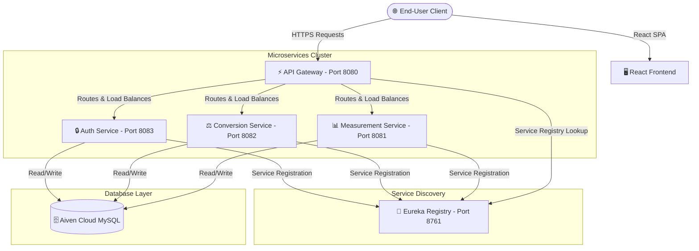

# 📐 Quantity Measurement App (QMA)

Welcome to the **Quantity Measurement App (QMA)**—a state-of-the-art, fully distributed, and production-ready microservices application built to perform precise physical quantity conversions (Length, Volume, Weight, and Temperature) with absolute accuracy.

The repository documents a highly structured evolutionary engineering journey—progressing systematically across **21 progressive development milestones (UC1 to UC21)** from basic object-oriented design and unit testing to an enterprise-grade, containerized N-tier microservices architecture.

---

## 🏗️ Architectural Topology

The system is engineered as a highly scalable **Microservices Architecture** leveraging the Spring Cloud ecosystem for discovery, security, routing, and dynamic unit conversions:



### 🧱 Core Microservices:
1. **🧭 Discovery Server (`eureka-server`):** Spring Cloud Netflix Eureka server facilitating dynamic registry lookup, health tracking, and load balancing across all service nodes.
2. **⚡ API Gateway (`api-gateway`):** Built with Spring Cloud Gateway. Serves as a single entry point for API consumers, managing security headers, CORS policies, routing, and aggregated Swagger/OpenAPI documentation.
3. **🔒 Authentication Service (`auth-service`):** Secures all communication using stateless **JWT Tokens** and integrates **Google OAuth2** for external social logins.
4. **⚖️ Conversion Service (`conversion-service`):** Executes core physics conversions, manages historical lookup data, handles custom/user-defined units, and caches favorite conversions.
5. **🖥️ Single Page Application (`frontend`):** Built with **React**, **Vite**, and styled with custom high-performance **Vanilla CSS/SCSS** utilizing elegant dark-mode themes, responsive grid-cards, and seamless glassmorphism cards.

---

## 🛠️ Technology Stack

* **Backend Engine:** Java 17, Spring Boot 3.x, Spring Cloud (Gateway, Eureka)
* **Data Access & Security:** Spring Data JPA, Hibernate, JWT, Spring Security (OAuth2)
* **Frontend SPA:** React 18, Vite, ES6 Javascript, Axios, React Context API
* **Database:** Production-grade Aiven Cloud MySQL / Local MySQL
* **Documentation:** Springdoc OpenAPI & Swagger UI (aggregated via Gateway)
* **Deployment & Ops:** Docker, Multi-stage Dockerfiles, Render Blueprints (`render.yaml`), Nginx

---

## 🚀 Chronological Evolutionary Journey (UC1 to UC21)

Every developmental milestone is cataloged as a distinct, production-grade implementation branch:

| Branch Name | Core Engineering Goals & Implementations |
| :--- | :--- |
| **`UC1`** | **Feet to Inches & Base Equality:** Establishing length objects and validating base metrics. |
| **`UC2`** | **Extended Equality:** Enhancing feet, inches, and yard comparisons to resolve physical equivalences. |
| **`UC3`** | **Generic Quantity DRY:** Eliminating duplicated metrics using generalized physical quantities. |
| **`UC4`** | **Extended Unit Support:** Incorporating Yards, Inches, and Centimeters conversions. |
| **`UC5`** | **Generalized Unit Conversions:** Designing dynamic formulaic unit-to-unit mapping. |
| **`UC6`** | **Summation Engine:** Adding lengths of different unit scales (e.g. Feet + Inches = Inches). |
| **`UC7`** | **Target Unit Summations:** Performing multi-unit additions targeting dynamic unit outputs. |
| **`UC8`** | **Refactored Enums:** Restructuring units as clean, self-contained standalone types. |
| **`UC9`** | **Weight Conversions:** Integrating Grams, Kilograms, and Tonnes into the conversion matrix. |
| **`UC10`** | **Decoupled Interfaces:** Introducing abstract unit interfaces for clean polymorphism. |
| **`UC11`** | **Volume Conversions:** Introducing Gallons, Litres, and Millilitres conversions. |
| **`UC12`** | **Arithmetic Extensibility:** Extending mathematical conversions to support subtraction and division. |
| **`UC13`** | **Functional Lambda Engine:** Refactoring mathematical operations using Java Lambdas. |
| **`UC14`** | **Temperature Conversions:** Adding Fahrenheit and Celsius scaling with base-offset rules. |
| **`UC15`** | **N-Tier Architecture:** Migrating to standard controller-service-repository patterns. |
| **`UC16`** | **Database Integration:** Introducing persistent storage using JDBC. |
| **`UC17`** | **Spring Boot Migration:** Restructuring the application as a Spring Boot web app. |
| **`UC18`** | **Spring Security & JWT:** Implementing secure stateless token authentication and user persistence. |
| **`UC19`** | **HTML/CSS/JS Frontend:** Developing the classic client web interface integrated with the REST API. |
| **`UC20`** | **React Frontend Integration:** Launching the interactive visual frontend. |
| **`UC21`** | **Microservices Architecture:** Factoring services into isolated Dockerized clusters. |

---

## 💻 Local Setup & Execution Guide

### 📋 Prerequisites
* **Java Development Kit (JDK 17)** installed
* **Node.js (v18+)** and `npm` installed
* **Maven** configured locally

### 🏁 Fast Startup (All Services)
You can launch the entire stack (Eureka, Auth, Conversion, Gateway, and React Frontend) sequentially using the automated PowerShell script.

1. Open a terminal inside the project directory:
   ```powershell
   ./start-microservices.ps1
   ```
2. The script will automatically:
   * Build all Java projects using Maven.
   * Launch **Eureka Server** on `http://localhost:8761`.
   * Start **Auth Service** (8083), **Conversion Service** (8082), and **API Gateway** (8080).
   * Initialize and launch the **React Dev Server** on `http://localhost:3000`.

---

## 🐳 Containerization & Cloud Deployment

Every component comes equipped with a production-ready, highly optimized **Multi-Stage Dockerfile** to build minimum-overhead production containers.

### Local Docker Compose Build:
```bash
docker-compose up --build
```

### Production Deployment (Render / Cloud-Native):
The monorepo contains a standard blueprint configuration file [`render.yaml`](file:///c:/Users/kiran/OneDrive/Documents/Claude/Projects/QMA/dev-branch/render.yaml) that automates the deployment of the entire microservices mesh directly to **Render**.

#### Required Production Secrets:
Configure these inside the cloud console key-store:
* `DB_URL` — Production connection string for database.
* `DB_USERNAME` / `DB_PASSWORD` — Database access credentials.
* `JWT_SECRET` — Symmetric signing key for JSON Web Tokens.
* `EUREKA_SERVER_URL` — Dynamic service registry callback path.

---

## 🔒 Security Policy
All endpoint communications (except Swagger UI and authentication routes) are fully secured behind standard **stateless JWT validation**. Additionally, user configurations and profile sessions are kept private using Spring Security encryption protocols.

---

## 👥 Authors & Contributors
* **Software Engineer:** BL-KiranKurhade ([kirankurhade-hub](https://github.com/kirankurhade-hub))